### [The Bespin Theme](../colorschemes/bespin.conf)

[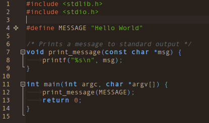](bespin.png "The Bespin Theme")

[The Bespin Theme Direct Download](https://raw.githubusercontent.com/geany/geany-themes/master/colorschemes/bespin.conf)

### [The Black Theme](../colorschemes/black.conf)

[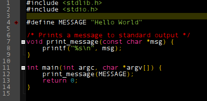](black.png "The Black Theme")

[The Black Theme Direct Download](https://raw.githubusercontent.com/geany/geany-themes/master/colorschemes/black.conf)

### [The Darcula Theme](../colorschemes/darcula.conf)

[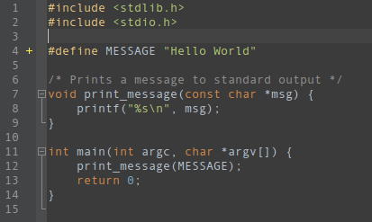](darcula.png "The Darcula Theme")

[The Darcula Theme Direct Download](https://raw.githubusercontent.com/geany/geany-themes/master/colorschemes/darcula.conf)

### [The DarkColors Theme](../colorschemes/dark-colors.conf)

[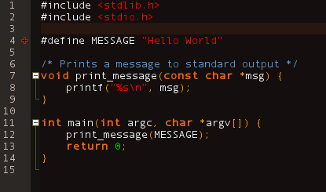](dark-colors.png "The DarkColors Theme")

[The DarkColors Theme Direct Download](https://raw.githubusercontent.com/geany/geany-themes/master/colorschemes/dark-colors.conf)

### [The DarkFruitSalad Theme](../colorschemes/dark-fruit-salad.conf)

[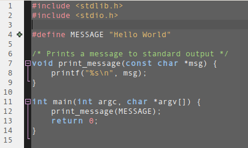](dark-fruit-salad.png "The DarkFruitSalad Theme")

[The DarkFruitSalad Theme Direct Download](https://raw.githubusercontent.com/geany/geany-themes/master/colorschemes/dark-fruit-salad.conf)

### [The Dark Theme](../colorschemes/dark.conf)

[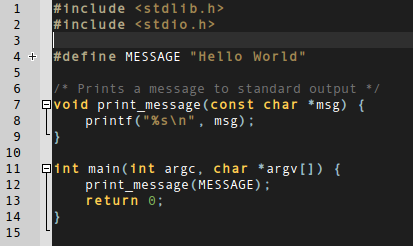](dark.png "The Dark Theme")

[The Dark Theme Direct Download](https://raw.githubusercontent.com/geany/geany-themes/master/colorschemes/dark.conf)

### [The DeltDark Theme](../colorschemes/delt-dark.conf)

[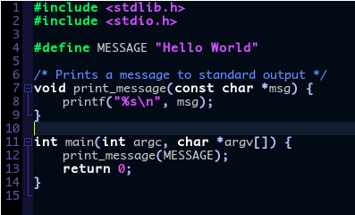](delt-dark.png "The DeltDark Theme")

[The DeltDark Theme Direct Download](https://raw.githubusercontent.com/geany/geany-themes/master/colorschemes/delt-dark.conf)

### [The Epsilon Theme](../colorschemes/epsilon.conf)

[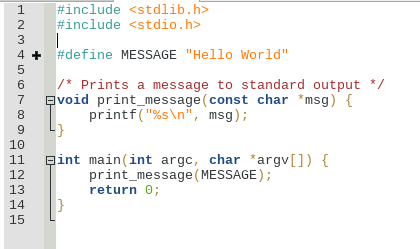](epsilon.png "The Epsilon Theme")

[The Epsilon Theme Direct Download](https://raw.githubusercontent.com/geany/geany-themes/master/colorschemes/epsilon.conf)

### [The Fluffy Theme](../colorschemes/fluffy.conf)

[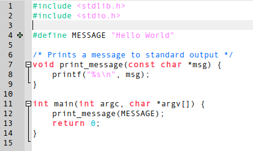](fluffy.png "The Fluffy Theme")

[The Fluffy Theme Direct Download](https://raw.githubusercontent.com/geany/geany-themes/master/colorschemes/fluffy.conf)

### [The Gedit Theme](../colorschemes/gedit.conf)

[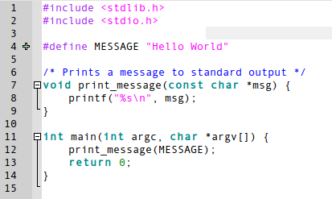](gedit.png "The Gedit Theme")

[The Gedit Theme Direct Download](https://raw.githubusercontent.com/geany/geany-themes/master/colorschemes/gedit.conf)

### [The Github Theme](../colorschemes/github.conf)

[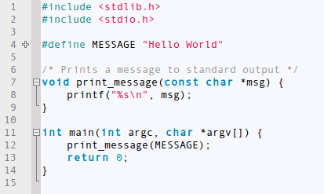](github.png "The Github Theme")

[The Github Theme Direct Download](https://raw.githubusercontent.com/geany/geany-themes/master/colorschemes/github.conf)

### [The Himbeere Theme](../colorschemes/himbeere.conf)

[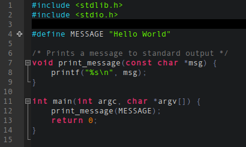](himbeere.png "The Himbeere Theme")

[The Himbeere Theme Direct Download](https://raw.githubusercontent.com/geany/geany-themes/master/colorschemes/himbeere.conf)

### [The Inkpot Theme](../colorschemes/inkpot.conf)

[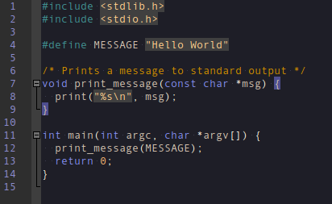](inkpot.png "The Inkpot Theme")

[The Inkpot Theme Direct Download](https://raw.githubusercontent.com/geany/geany-themes/master/colorschemes/inkpot.conf)

### [The Mc Theme](../colorschemes/mc.conf)

[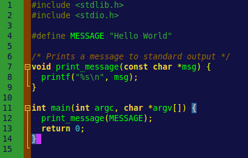](mc.png "The Mc Theme")

[The Mc Theme Direct Download](https://raw.githubusercontent.com/geany/geany-themes/master/colorschemes/mc.conf)

### [The MetallicBottle Theme](../colorschemes/metallic-bottle.conf)

[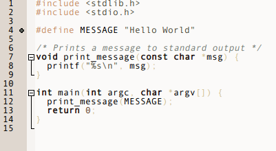](metallic-bottle.png "The MetallicBottle Theme")

[The MetallicBottle Theme Direct Download](https://raw.githubusercontent.com/geany/geany-themes/master/colorschemes/metallic-bottle.conf)

### [The Monokai Theme](../colorschemes/monokai.conf)

[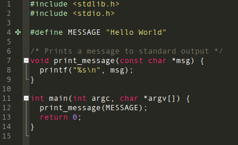](monokai.png "The Monokai Theme")

[The Monokai Theme Direct Download](https://raw.githubusercontent.com/geany/geany-themes/master/colorschemes/monokai.conf)

### [The NotepadPlusPlus Theme](../colorschemes/notepad-plus-plus.conf)

[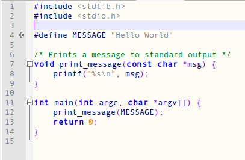](notepad-plus-plus.png "The NotepadPlusPlus Theme")

[The NotepadPlusPlus Theme Direct Download](https://raw.githubusercontent.com/geany/geany-themes/master/colorschemes/notepad-plus-plus.conf)

### [The Oblivion2 Theme](../colorschemes/oblivion2.conf)

[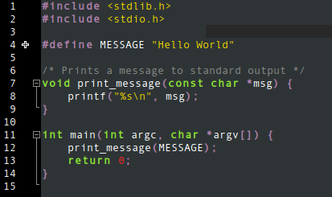](oblivion2.png "The Oblivion2 Theme")

[The Oblivion2 Theme Direct Download](https://raw.githubusercontent.com/geany/geany-themes/master/colorschemes/oblivion2.conf)

### [The Pygments Theme](../colorschemes/pygments.conf)

[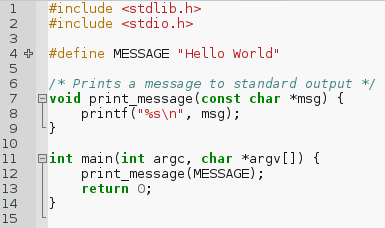](pygments.png "The Pygments Theme")

[The Pygments Theme Direct Download](https://raw.githubusercontent.com/geany/geany-themes/master/colorschemes/pygments.conf)

### [The Railcasts2 Theme](../colorschemes/railcasts2.conf)

[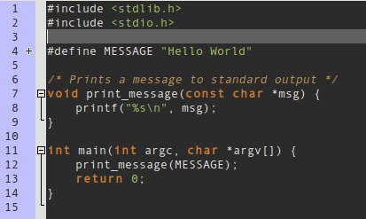](railcasts2.png "The Railcasts2 Theme")

[The Railcasts2 Theme Direct Download](https://raw.githubusercontent.com/geany/geany-themes/master/colorschemes/railcasts2.conf)

### [The Retro Theme](../colorschemes/retro.conf)

[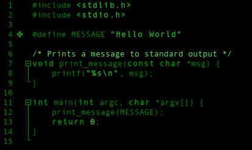](retro.png "The Retro Theme")

[The Retro Theme Direct Download](https://raw.githubusercontent.com/geany/geany-themes/master/colorschemes/retro.conf)

### [The SleepyPastel Theme](../colorschemes/sleepy-pastel.conf)

[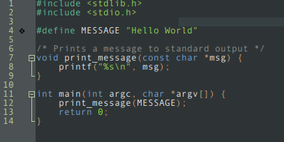](sleepy-pastel.png "The SleepyPastel Theme")

[The SleepyPastel Theme Direct Download](https://raw.githubusercontent.com/geany/geany-themes/master/colorschemes/sleepy-pastel.conf)

### [The Slushpoppies Theme](../colorschemes/slushpoppies.conf)

[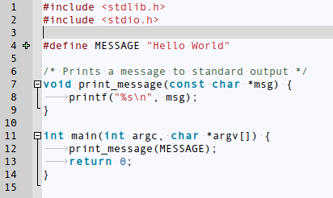](slushpoppies.png "The Slushpoppies Theme")

[The Slushpoppies Theme Direct Download](https://raw.githubusercontent.com/geany/geany-themes/master/colorschemes/slushpoppies.conf)

### [The SolarizedDark Theme](../colorschemes/solarized-dark.conf)

[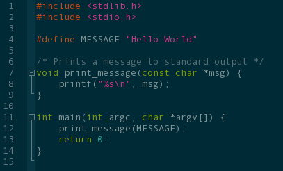](solarized-dark.png "The SolarizedDark Theme")

[The SolarizedDark Theme Direct Download](https://raw.githubusercontent.com/geany/geany-themes/master/colorschemes/solarized-dark.conf)

### [The SolarizedLight Theme](../colorschemes/solarized-light.conf)

[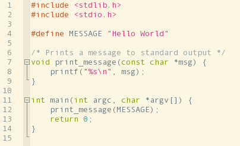](solarized-light.png "The SolarizedLight Theme")

[The SolarizedLight Theme Direct Download](https://raw.githubusercontent.com/geany/geany-themes/master/colorschemes/solarized-light.conf)

### [The SpyderDark Theme](../colorschemes/spyder-dark.conf)

[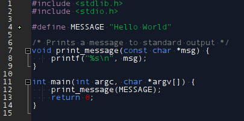](spyder-dark.png "The SpyderDark Theme")

[The SpyderDark Theme Direct Download](https://raw.githubusercontent.com/geany/geany-themes/master/colorschemes/spyder-dark.conf)

### [The Steampunk Theme](../colorschemes/steampunk.conf)

[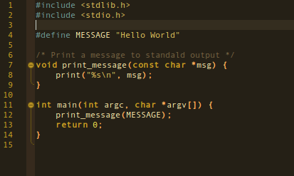](steampunk.png "The Steampunk Theme")

[The Steampunk Theme Direct Download](https://raw.githubusercontent.com/geany/geany-themes/master/colorschemes/steampunk.conf)

### [The TangoDark Theme](../colorschemes/tango-dark.conf)

[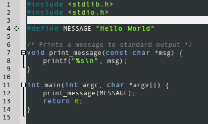](tango-dark.png "The TangoDark Theme")

[The TangoDark Theme Direct Download](https://raw.githubusercontent.com/geany/geany-themes/master/colorschemes/tango-dark.conf)

### [The TangoLight Theme](../colorschemes/tango-light.conf)

[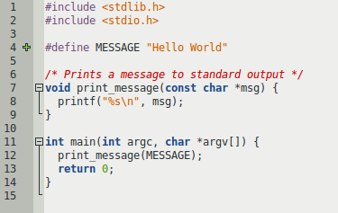](tango-light.png "The TangoLight Theme")

[The TangoLight Theme Direct Download](https://raw.githubusercontent.com/geany/geany-themes/master/colorschemes/tango-light.conf)

### [The Tinge Theme](../colorschemes/tinge.conf)

[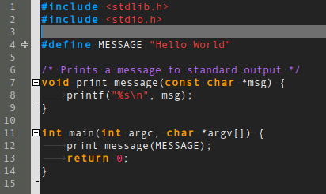](tinge.png "The Tinge Theme")

[The Tinge Theme Direct Download](https://raw.githubusercontent.com/geany/geany-themes/master/colorschemes/tinge.conf)

### [The Ubuntu Theme](../colorschemes/ubuntu.conf)

[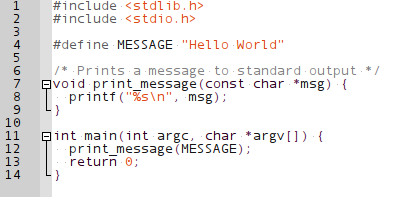](ubuntu.png "The Ubuntu Theme")

[The Ubuntu Theme Direct Download](https://raw.githubusercontent.com/geany/geany-themes/master/colorschemes/ubuntu.conf)

### [The VibrantInk Theme](../colorschemes/vibrant-ink.conf)

[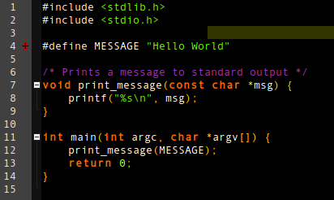](vibrant-ink.png "The VibrantInk Theme")

[The VibrantInk Theme Direct Download](https://raw.githubusercontent.com/geany/geany-themes/master/colorschemes/vibrant-ink.conf)

### [The Zenburn Theme](../colorschemes/zenburn.conf)

[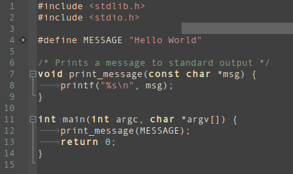](zenburn.png "The Zenburn Theme")

[The Zenburn Theme Direct Download](https://raw.githubusercontent.com/geany/geany-themes/master/colorschemes/zenburn.conf)

