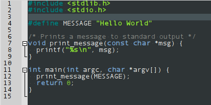

### [The Monokai Theme](../colorschemes/monokai.conf)

[The Monokai Theme Direct Download](https://raw.githubusercontent.com/geany/geany-themes/master/colorschemes/monokai.conf)

### [The Bespin Theme](../colorschemes/bespin.conf)

[The Bespin Theme Direct Download](https://raw.githubusercontent.com/geany/geany-themes/master/colorschemes/bespin.conf)

### [The Black Scheme Theme](../colorschemes/black.conf)

[The Black Scheme Theme Direct Download](https://raw.githubusercontent.com/geany/geany-themes/master/colorschemes/black.conf)

### [The Darcula Theme](../colorschemes/darcula.conf)

[The Darcula Theme Direct Download](https://raw.githubusercontent.com/geany/geany-themes/master/colorschemes/darcula.conf)

### [The Dark Colors Theme](../colorschemes/dark-colors.conf)

[The Dark Colors Theme Direct Download](https://raw.githubusercontent.com/geany/geany-themes/master/colorschemes/dark-colors.conf)

### [The Dark Fruit Salad Theme](../colorschemes/dark-fruit-salad.conf)

[The Dark Fruit Salad Theme Direct Download](https://raw.githubusercontent.com/geany/geany-themes/master/colorschemes/dark-fruit-salad.conf)

### [The Dark Theme](../colorschemes/dark.conf)

[The Dark Theme Direct Download](https://raw.githubusercontent.com/geany/geany-themes/master/colorschemes/dark.conf)

### [The Delt Dark Theme](../colorschemes/delt-dark.conf)

[The Delt Dark Theme Direct Download](https://raw.githubusercontent.com/geany/geany-themes/master/colorschemes/delt-dark.conf)

### [The Epsilon Theme](../colorschemes/epsilon.conf)

[The Epsilon Theme Direct Download](https://raw.githubusercontent.com/geany/geany-themes/master/colorschemes/epsilon.conf)

### [The Fluffy Theme](../colorschemes/fluffy.conf)

[The Fluffy Theme Direct Download](https://raw.githubusercontent.com/geany/geany-themes/master/colorschemes/fluffy.conf)

### [The Gedit Theme](../colorschemes/gedit.conf)

[The Gedit Theme Direct Download](https://raw.githubusercontent.com/geany/geany-themes/master/colorschemes/gedit.conf)

### [The GitHub Theme](../colorschemes/github.conf)

[The GitHub Theme Direct Download](https://raw.githubusercontent.com/geany/geany-themes/master/colorschemes/github.conf)

### [The Himbeere Theme](../colorschemes/himbeere.conf)

[The Himbeere Theme Direct Download](https://raw.githubusercontent.com/geany/geany-themes/master/colorschemes/himbeere.conf)

### [The InkPot Theme](../colorschemes/inkpot.conf)

[The InkPot Theme Direct Download](https://raw.githubusercontent.com/geany/geany-themes/master/colorschemes/inkpot.conf)

### [The Kugel Theme](../colorschemes/kugel.conf)

[The Kugel Theme Direct Download](https://raw.githubusercontent.com/geany/geany-themes/master/colorschemes/kugel.conf)

### [The Ralesk's MC Theme](../colorschemes/mc.conf)

[The Ralesk's MC Theme Direct Download](https://raw.githubusercontent.com/geany/geany-themes/master/colorschemes/mc.conf)

### [The Metallic Bottle Theme](../colorschemes/metallic-bottle.conf)

[The Metallic Bottle Theme Direct Download](https://raw.githubusercontent.com/geany/geany-themes/master/colorschemes/metallic-bottle.conf)

### [The Notepad-plus-plus Theme](../colorschemes/notepad-plus-plus.conf)

[The Notepad-plus-plus Theme Direct Download](https://raw.githubusercontent.com/geany/geany-themes/master/colorschemes/notepad-plus-plus.conf)

### [The Oblivion 2 Theme](../colorschemes/oblivion2.conf)

[The Oblivion 2 Theme Direct Download](https://raw.githubusercontent.com/geany/geany-themes/master/colorschemes/oblivion2.conf)

### [The Pygments Theme](../colorschemes/pygments.conf)

[The Pygments Theme Direct Download](https://raw.githubusercontent.com/geany/geany-themes/master/colorschemes/pygments.conf)

### [The Railcasts 2 Theme](../colorschemes/railcasts2.conf)

[The Railcasts 2 Theme Direct Download](https://raw.githubusercontent.com/geany/geany-themes/master/colorschemes/railcasts2.conf)

### [The Retro Theme](../colorschemes/retro.conf)

[The Retro Theme Direct Download](https://raw.githubusercontent.com/geany/geany-themes/master/colorschemes/retro.conf)

### [The Sleepy Pastel Theme](../colorschemes/sleepy-pastel.conf)

[The Sleepy Pastel Theme Direct Download](https://raw.githubusercontent.com/geany/geany-themes/master/colorschemes/sleepy-pastel.conf)

### [The Slush and Poppies Theme](../colorschemes/slushpoppies.conf)

[The Slush and Poppies Theme Direct Download](https://raw.githubusercontent.com/geany/geany-themes/master/colorschemes/slushpoppies.conf)

### [The Solarized (dark) Theme](../colorschemes/solarized-dark.conf)

 Theme")

[The Solarized (dark) Theme Direct Download](https://raw.githubusercontent.com/geany/geany-themes/master/colorschemes/solarized-dark.conf)

### [The Solarized (light) Theme](../colorschemes/solarized-light.conf)

 Theme")

[The Solarized (light) Theme Direct Download](https://raw.githubusercontent.com/geany/geany-themes/master/colorschemes/solarized-light.conf)

### [The Spyder Dark Theme](../colorschemes/spyder-dark.conf)

[The Spyder Dark Theme Direct Download](https://raw.githubusercontent.com/geany/geany-themes/master/colorschemes/spyder-dark.conf)

### [The Steampunk Theme](../colorschemes/steampunk.conf)

[The Steampunk Theme Direct Download](https://raw.githubusercontent.com/geany/geany-themes/master/colorschemes/steampunk.conf)

### [The Tango Theme](../colorschemes/tango-dark.conf)

[The Tango Theme Direct Download](https://raw.githubusercontent.com/geany/geany-themes/master/colorschemes/tango-dark.conf)

### [The Tango Light Theme](../colorschemes/tango-light.conf)

[The Tango Light Theme Direct Download](https://raw.githubusercontent.com/geany/geany-themes/master/colorschemes/tango-light.conf)

### [The Tinge Theme](../colorschemes/tinge.conf)

[The Tinge Theme Direct Download](https://raw.githubusercontent.com/geany/geany-themes/master/colorschemes/tinge.conf)

### [The Ubuntu Theme](../colorschemes/ubuntu.conf)

[The Ubuntu Theme Direct Download](https://raw.githubusercontent.com/geany/geany-themes/master/colorschemes/ubuntu.conf)

### [The Vibrant Theme](../colorschemes/vibrant-ink.conf)

[The Vibrant Theme Direct Download](https://raw.githubusercontent.com/geany/geany-themes/master/colorschemes/vibrant-ink.conf)

### [The Zenburn Theme](../colorschemes/zenburn.conf)

[The Zenburn Theme Direct Download](https://raw.githubusercontent.com/geany/geany-themes/master/colorschemes/zenburn.conf)

